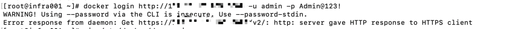
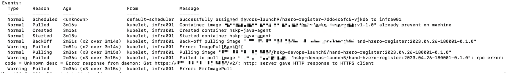
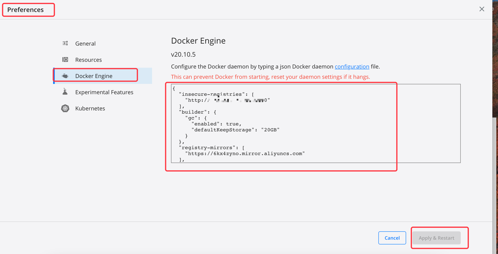

# docker登录harbor、K8s拉取镜像报http: server gave HTTP response to HTTPS client
当搭建完docker私有仓库后，准备docker login http://ip:端口 登录时会包如下错误


当我们使用docker私有仓库中的镜像在K8s集群中部署应用时会包如下错误


以上错误根据报错信息可以知道，不能使用不安全的http协议连接远程仓库。一种方式是使用https协议进行访问，但需要我们在docker客户端维护好证书；
另一种方式是在insecure-registries配置项中设置仓库地址，允许访问远程仓库

## 在linux中设置docker insecure-registries

- vim /etc/docker/daemon.json 在insecure-registries配置项中添加私有仓库地址
```
{
  "insecure-registries": [
    "http://172.17.13.1:5000"
  ],
  "builder": {
    "gc": {
      "enabled": true,
      "defaultKeepStorage": "20GB"
    }
  },
  "registry-mirrors": [
    "https://6kx4zyno.mirror.aliyuncs.com"
  ],
  "features": {
    "buildkit": true
  },
  "experimental": false
}
```

- 重启docker使配置生效
```
systemctl daemon-reload
systemctl restart docker
```

## 在mac中设置docker insecure-registries
mac中安装的docker使用图形化界面管理，可以通过如下步骤设置

- 打开Preferences菜单，选择Docker Engine，配置insecure-registries。修改完成后，点击apply & Restart完成

  
```
{
  "insecure-registries": [
    "http://172.17.13.0:5000"
  ],
  "builder": {
    "gc": {
      "enabled": true,
      "defaultKeepStorage": "20GB"
    }
  },
  "registry-mirrors": [
    "https://6kx4zyno.mirror.aliyuncs.com"
  ],
  "features": {
    "buildkit": true
  },
  "experimental": false
}
```
